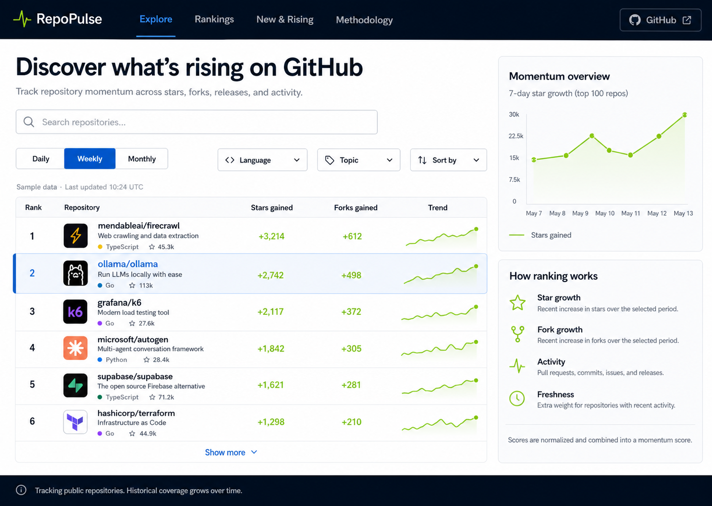

# RepoPulse

[English](README.md) | [简体中文](README.zh-CN.md)

通过早期增长、新鲜度、活跃度和趋势，发现新的、正在崛起的 GitHub 项目。

RepoPulse 是一个开源的 GitHub 仓库发现面板。它会持续记录公开仓库的时间快照，让开发者能够比较每日、每周和每月的增长势头，同时降低老牌超大项目在累计 Star 上的天然优势。



## 主要功能

- 每日、每周和每月新锐项目视图
- Star 增长、Fork 增长、早期速度、新鲜度及可解释的发现分排序
- 仓库搜索、编程语言筛选和 Topic 筛选
- 中英文界面切换，语言状态可通过 URL 分享
- 响应式桌面端和移动端布局
- 筛选条件同步到 URL，便于分享当前视图
- 带 RLS 和快照查询索引的 Supabase 数据结构
- GitHub Actions 每 6 小时自动采集一次，并扩大新项目候选池
- 配置 Supabase 前使用有明确标记的示例数据回退

## 系统架构

```text
GitHub Actions + 短期 GITHUB_TOKEN
                ↓
          GitHub 公共 REST API
                ↓
      Supabase 仓库数据 + 时间快照
                ↓
       Next.js Server Components
                ↓
              Vercel
```

浏览器端不会接收到 GitHub Token 或 Supabase Service Role Key。安全设计和数据流详情请参阅 [docs/architecture.md](docs/architecture.md)。

## 本地开发

环境要求：

- Node.js 24
- npm

```bash
npm install
npm run dev
```

打开 `http://localhost:3000`。如果尚未配置 Supabase 环境变量，应用会主动显示带有“示例数据”标记的数据集，因此界面开发和部署预览仍然可以正常进行。

在地址后加入 `?lang=zh` 可直接打开中文界面，例如：

```text
http://localhost:3000/?lang=zh
```

## Supabase 配置

1. 创建 Supabase 项目。
2. 执行 [`supabase/migrations/202607160001_initial_schema.sql`](supabase/migrations/202607160001_initial_schema.sql)。
3. 将 `.env.example` 复制为 `.env.local`，填写公开的项目 URL 和 Anon Key。
4. 在 GitHub Actions 仓库 Secrets 中添加 `SUPABASE_URL` 和 `SUPABASE_SERVICE_ROLE_KEY`。

Vercel 环境变量：

```text
NEXT_PUBLIC_SUPABASE_URL
NEXT_PUBLIC_SUPABASE_ANON_KEY
```

GitHub Actions Secrets：

```text
SUPABASE_URL
SUPABASE_SERVICE_ROLE_KEY
```

`GITHUB_TOKEN` 会由每次 GitHub Actions 任务自动生成。MVP 采集任务不需要创建个人访问令牌。

## 数据采集

设置所需环境变量后，可以在本地运行：

```bash
npm run collect
```

采集器通过 GitHub Search 获取数量受控的候选仓库，完成去重、发现分排序和批量写入，并为每个仓库每小时最多记录一份快照。它会优先考虑新创建仓库、近期 push、早期 Star 速度，以及 AI/开发工具等新兴 Topic，而不是简单保留累计 Star 最高的大仓库。定时工作流每 6 小时运行一次；在 Supabase Secrets 尚未配置时会安全跳过采集。

## AI 模型

RepoPulse 的核心排行榜不需要 AI 大模型。GitHub Search、仓库元数据、Supabase 快照和 Postgres 排名函数已经可以完成发现与排序。

采集器可以可选读取排名前 25 的候选仓库元数据和 README 片段，再把中英文结构化项目识别结果写回 Supabase。SenseNova 使用 `SenseNova-V6.5-Turbo` 作为主模型；遇到超时、限流或服务端异常时，可使用 `deepseek-v4-flash` 重试一次。已有结果超过 72 小时才会重新生成，模型 Key 始终只放服务端。

```text
AI_PROJECT_INSIGHTS_ENABLED
AI_PROJECT_INSIGHTS_LIMIT
SENSENOVA_API_KEY
SENSENOVA_BASE_URL
SENSENOVA_MODEL
DEEPSEEK_API_KEY
DEEPSEEK_BASE_URL
DEEPSEEK_MODEL
```

## 排名说明

GitHub API 不会直接提供“过去七天新增 Star”这样的任意周期字段。RepoPulse 会使用自己积累的快照计算增长量。在历史数据积累充分之前，网站会明确说明排行榜仅覆盖已追踪的仓库，以及从开始追踪到当前的可用周期。

首版排名公式和已知偏差请参阅 [docs/methodology.md](docs/methodology.md)。

## 常用命令

```bash
npm run dev
npm run lint
npm run typecheck
npm run build
npm run check
npm run collect
```

## 部署

将 Next.js 应用部署到 Vercel 并连接 `main` 分支。前端只读取 Supabase 中公开的排行榜数据，采集逻辑独立运行在 GitHub Actions 中。

## 开源许可证

[MIT](LICENSE)
