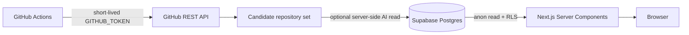

# Architecture

RepoPulse separates collection, storage, and presentation so credentials never need to reach the browser.

## Collection boundary

`scripts/collect.ts` runs in GitHub Actions. It uses the job-scoped `GITHUB_TOKEN` to query public repository metadata and a Supabase service-role key to write batches. Neither credential is available to the Next.js client bundle.

When `AI_PROJECT_INSIGHTS_ENABLED=true`, the collector checks the top 25 discovery candidates and generates insights only when a repository has no prior result or the stored result is older than 72 hours. SenseNova is the primary server-side model. Network timeouts, HTTP 429 responses, and HTTP 5xx responses can retry once with DeepSeek. Both English and Simplified Chinese category, summary, audience, reason, and signals are stored as public read data. Model keys stay in Actions secrets.

The collector uses a broader set of bounded searches:

- repositories created in the last two weeks with early traction;
- repositories created in the last month below the mega-repository range;
- active repositories created in the last quarter;
- small repositories pushed in the last week;
- recent AI, agent, LLM, MCP, and developer-tool repositories.

Results are deduplicated, scored with a discovery heuristic, and capped with `MAX_REPOSITORIES`. The heuristic considers repository age, recent activity, early star velocity, and traction while penalizing very large established repositories. The site should therefore say “tracked repositories” until a more comprehensive event source is introduced.

## Read boundary

The Next.js page loads daily, weekly, and monthly rankings in parallel through the `get_repository_rankings` Postgres function. Supabase anonymous access is read-only and protected by RLS. No browser-side request can insert or update repository data.

## Failure behavior

- Missing public Supabase variables: render the labeled sample dataset.
- Empty or failed ranking RPC: render the labeled sample dataset and log a server warning.
- Missing Actions secrets: skip scheduled collection without failing the workflow.
- Missing or disabled AI model variables: skip model enrichment and keep metadata-derived project reads in the UI.
- SenseNova availability failure with DeepSeek configured: retry the repository once with DeepSeek.
- Both model requests fail: keep the last successful insight and leave its enrichment timestamp unchanged.
- Missing historical baseline: return zero growth until enough snapshots exist.

## Future scaling path

When GitHub Search coverage or Actions rate limits become a constraint, replace the workflow token with a dedicated GitHub App and consider GitHub Archive for broader event coverage. The database and frontend contracts can remain unchanged.
