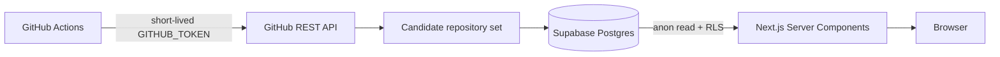

# Architecture

RepoPulse separates collection, storage, and presentation so credentials never need to reach the browser.

## Collection boundary

`scripts/collect.ts` runs in GitHub Actions. It uses the job-scoped `GITHUB_TOKEN` to query public repository metadata and a Supabase service-role key to write batches. Neither credential is available to the Next.js client bundle.

The collector currently uses three bounded searches:

- established repositories pushed recently;
- new repositories with early star traction;
- recently active AI repositories.

Results are deduplicated and capped with `MAX_REPOSITORIES`. The site should therefore say “tracked repositories” until a more comprehensive event source is introduced.

## Read boundary

The Next.js page loads daily, weekly, and monthly rankings in parallel through the `get_repository_rankings` Postgres function. Supabase anonymous access is read-only and protected by RLS. No browser-side request can insert or update repository data.

## Failure behavior

- Missing public Supabase variables: render the labeled sample dataset.
- Empty or failed ranking RPC: render the labeled sample dataset and log a server warning.
- Missing Actions secrets: skip scheduled collection without failing the workflow.
- Missing historical baseline: return zero growth until enough snapshots exist.

## Future scaling path

When GitHub Search coverage or Actions rate limits become a constraint, replace the workflow token with a dedicated GitHub App and consider GitHub Archive for broader event coverage. The database and frontend contracts can remain unchanged.
